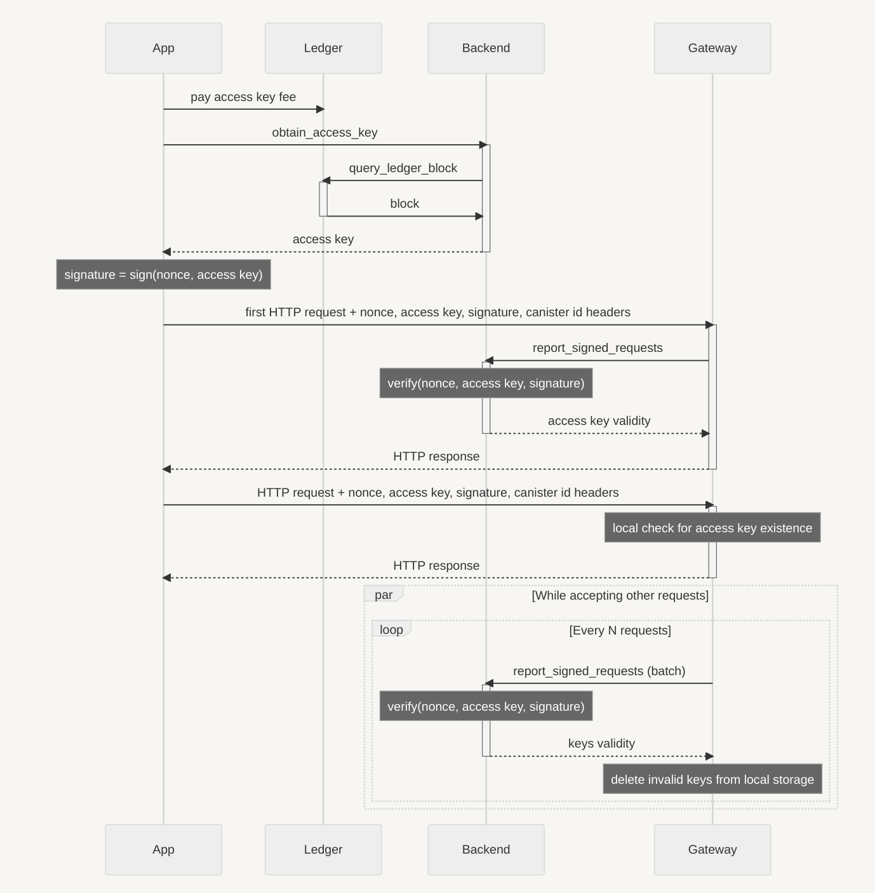

# Access Key

The access key gives an Application the permission to interact with the devices through the Gateway.

This is the process to obtain an access key:

It can be divided in 3 main steps:

- **Application** pays the **Backend** to obtain an access key: in this step the Backend verifies that the Application successfully paid the fee and generates an access key. This access key is valid for a fixed number of requests and the Application saves it locally.

- **First request**: the Application sends the first HTTP request to the Gateway, passing the access key, a nonce and the signature `sig(nonce, access key)`. This way, the access key cannot be used by anyone else than the Application that paid for it and the Backend can count the number of requests made with that access key.

  The Gateway reports the `(nonce, access key, signature)` tuple to the Backend, that can verify that the access key is valid, that the signature is valid (against the Application public key), that the nonce has never been used before. If checks pass, the Gateway saves the access key locally.

- **Subsequent requests**: the Application sends subsequent HTTP requests to the Gateway, passing the access key and a new nonce for each request, together with the signature of the two. The Gateway collects the `(nonce, access key, signature)` tuple and gives access to the resource requested **only** by checking if the access key is present in the local storage.

  After receiving a batch of N requests (from any Application), the Gateway reports the batch to the Backend, that can verify the signatures and the nonces, along with the number of times the access key has been used. The Backend responds with the keys that are not valid anymore, so that the Gateway can remove them from the local storage. If a new HTTP request is received with an access key that is not valid anymore, the Gateway responds with an error.