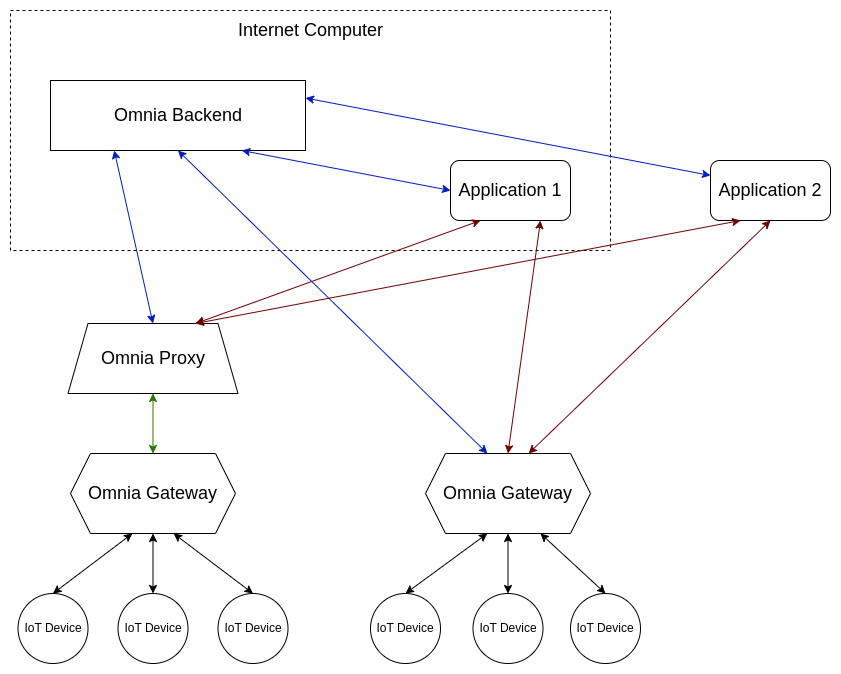

# Omnia Network Architecture
The Omnia Network structure can be represented by this schema:

The main components are:
- **Omnia Backend**, that manages the registration and indexing of Gateways, Devices and Applications. It also offers an admin interface for **Managers**, the people that own the Devices and make them available by installing a Gateway. See [README](../README.md#structure) for details.
- **Omnia Gateway**, that is deployed near to devices and makes them available through the [Web of Things (WoT)](https://www.w3.org/WoT/) standard. See [omnia-network/omnia-gateway](https://github.com/omnia-network/omnia-gateway) repository for details.
- **IoT Devices**, that are spread all over the world and can communicate in different IoT protocols.
- **Applications**, that can discover the devices by querying the **RDF endpoint** exposed by the Backend and can interact with them through the Gateways. These applications are developed by third parties and can be deployed anywhere (e.g. on the Internet Computer, on AWS, etc.).

The **Omnia Proxy**, instead, is not a core component of the Omnia Network. It's a useful tool provided by Omnia to make the WoT endpoint of the Gateway available to the Internet in such cases where the Gateway is behind a NAT or a firewall, doesn't have a public IP address, port forwarding is not possible or any other reason that makes it not publicly accessible. See [omnia-network/omnia-proxy](https://github.com/omnia-network/omnia-proxy) repository for details on how it works.
